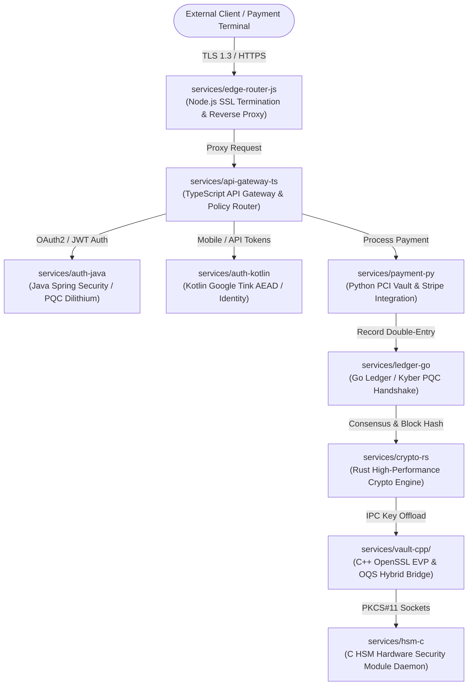

# Nexis Core Platform: Enterprise Polyglot Financial Ledger & Cryptographic Testbed

[](#ground-truth-and-spectra-validation)
[](#quantum-risk-analysis-and-moscas-inequality)
[](#system-architecture--service-topology)
[-green.svg)](#codebase-structure--manifest-inventory)

---

## 1. Executive Overview

**Nexis Core** is an enterprise-grade, polyglot financial ledger, payment gateway, and cryptographic operations testbed. It models a production-scale distributed banking architecture featuring double-entry bookkeeping, strict ACID ledger consistency, high-throughput edge routing, PCI-DSS tokenized payment vaults, multi-tenant authentication, and hardware security module (HSM) key lifecycle management.

Beyond its role as a functional enterprise architecture, **Nexis Core is purposefully engineered as an authoritative validation testbed for Spectra**, an enterprise Cryptographic Inventory and Cryptographic Bill of Materials (CBOM) static analysis engine. 

### Core Engineering Directives
1. **Precise AST Detection**: Every cryptographic primitive strictly adheres to Spectra's AST signatures across 9 language ecosystems (`libraries_*.yaml`, `algorithms.yaml`, `dependencies.yaml`).
2. **True Blast-Radius Call Graphs**: Cryptographic utility functions are invoked repeatedly across downstream business modules to validate direct ($X$) and transitive ($Y$) call-graph dependency mapping.
3. **Rigorous False-Positive Traps**: 50% to 60% of files are pure business logic, intentionally embedded with deceptive strings (`"AES"`, `"RSA"`, `"DES"`, algorithm acronyms, and theoretical comments) to stress-test scanner precision.
4. **Post-Quantum Hybrid Readiness**: Implements both classical algorithms (RSA-2048/4096, ECDSA, Ed25519, AES-GCM) and NIST-standardized Post-Quantum Cryptography (ML-KEM-768 / Kyber-768, ML-DSA-65 / Dilithium) to evaluate quantum vulnerability auditing against Mosca's Inequality.

---

## 2. System Architecture & Service Topology

The platform comprises **9 discrete microservices** spanning 9 programming languages, each implementing a distinct tier of the enterprise financial ecosystem:



### Microservice Directory Layout

| Service Path | Language | Primary Enterprise Domain | Primary Cryptographic Stack |
| :--- | :--- | :--- | :--- |
| `services/edge-router-js` | JavaScript (Node.js) | Edge SSL terminator, dynamic load balancer, HTTP rate limiting | Node.js `tls`, `https`, `crypto`, `crypto-js` |
| `services/api-gateway-ts` | TypeScript | Ingress routing, JWT claims validation, HMAC policy signing | Node.js `crypto`, `jsonwebtoken`, `jose` |
| `services/auth-java` | Java 17+ | Enterprise IAM, LDAP federation, Dilithium signature issuer | `java.security`, `javax.crypto`, Bouncy Castle PQC |
| `services/auth-kotlin` | Kotlin | Mobile auth provider, TLS session manager, token rotation | Google Tink (`AeadConfig`), Ktor TLS, Java JCA |
| `services/payment-py` | Python 3.11+ | PCI-DSS payment tokenization, webhook HMAC, card encryption | `cryptography` (Fernet, AES-GCM, RSA), `hashlib`, `hmac` |
| `services/ledger-go` | Go 1.22+ | Double-entry ledger, transaction signing, PQC peer handshake | Standard `crypto/*`, Cloudflare CIRCL (`kyber768`) |
| `services/crypto-rs` | Rust 2021 | High-throughput block hasher, Ring signatures, PQC envelope | `ring`, `aes-gcm`, `pqcrypto-kyber` |
| `services/hsm-c` | C (C11) | PKCS#11 HSM driver daemon, hardware entropy pool, memory wiping | OpenSSL `libcrypto`, OQS C library (`liboqs`) |
| `services/vault-cpp` | C++ (C++20) | Secure enterprise key vault, EVP cipher engine, key rotation | OpenSSL `EVP`, `liboqs` C++ wrappers |

---

## 3. Cryptographic Implementation & Spectra Rule Alignment

Every cryptographic call in Nexis Core is written to trigger specific AST and token patterns defined in Spectra's detection rules:

### A. TypeScript (`services/api-gateway-ts`)
- **`src/jwt_validator.ts`**: Uses `jsonwebtoken.verify()` and `jose.jwtVerify()` with explicit algorithms `HS256`, `RS256`, and `ES384`.
- **`src/node_crypto_signer.ts`**: Uses `crypto.createSign('RSA-SHA256')`, `crypto.createVerify('RSA-SHA256')`, and `crypto.createHmac('sha384')`.
- **`src/secure_vault_client.ts`**: Uses `crypto.createCipheriv('aes-256-gcm')`, `crypto.createDecipheriv('aes-256-gcm')`, and `crypto.randomBytes()`.
- **`src/token_service.ts`**: Uses `jsonwebtoken.sign()`, `jose.SignJWT()`, and `crypto.generateKeyPairSync('rsa')`.
- *Business Logic (Non-Crypto)*: `src/gateway_router.ts`, `src/rate_limiter.ts`, `src/edge_logger.ts`, `src/cors_policy.ts`, `src/circuit_breaker.ts`, `src/request_sanitizer.ts`, `src/proxy_middleware.ts`, `src/telemetry_emitter.ts`, `src/gateway_types.ts`, `src/index.ts`. All TypeScript code resides exclusively in `src/`.

### B. JavaScript (`services/edge-router-js`)
- **`src/ssl_terminator.js`**: Invokes `tls.createSecureContext({ minVersion: 'TLSv1.3' })` and `https.createServer()`.
- **`src/crypto_utils.js`**: Integrates `CryptoJS.AES.encrypt/decrypt()`, `CryptoJS.HmacSHA256()`, and `CryptoJS.SHA256()`.
- **`src/session_token.js`**: Generates high-entropy session keys with `crypto.randomBytes()` and `crypto.pbkdf2Sync()`.
- **`src/signature_verifier.js`**: Validates request digests with `crypto.createHmac('sha256')` and `crypto.timingSafeEqual()`.
- *Business Logic (Non-Crypto)*: `src/server_entry.js`, `src/cookie_jar.js`, `src/header_injector.js`, `src/health_check.js`, `src/load_balancer.js`, `src/metrics_collector.js`, `src/session_manager.js`, `src/error_handler.js`, `src/router_utils.js`, `src/index.js`. All JavaScript code resides exclusively in `src/`.

### C. Java (`services/auth-java`)
- **`TokenIssuer.java`**: Implements `KeyPairGenerator.getInstance("RSA")` (2048-bit), `Signature.getInstance("SHA256withRSA")`.
- **`PasswordHasher.java`**: Utilizes `SecretKeyFactory.getInstance("PBKDF2WithHmacSHA256")` and `MessageDigest.getInstance("SHA-256")`.
- **`KeyStoreManager.java`**: Manages `KeyStore.getInstance("PKCS12")` and `Cipher.getInstance("AES/GCM/NoPadding")`.
- **`PqcDilithiumSigner.java`**: Bouncy Castle PQC implementation using `DilithiumKeyPairGenerator` and `DilithiumSigner` (NIST Level 3 / Dilithium3).
- *Business Logic (Non-Crypto)*: `AuthController.java`, `AuthMetrics.java`, `SessionValidator.java`, `UserPrincipal.java`, `LdapConnector.java`, `AuditTrailLogger.java`, `AuthException.java`.

### D. Kotlin (`services/auth-kotlin`)
- **`KtCryptoAdapter.kt`**: Google Tink integration using `AeadConfig.register()`, `KeysetHandle.generateNew(KeyTemplates.get("AES256_GCM"))`, and `aead.encrypt/decrypt`.
- **`KtTlsConfig.kt`**: Ktor TLS engine configuring `TLSConfigBuilder` with TLS 1.3 suites.
- **`KtJcaSigner.kt`**: Native JCA wrapper with `Signature.getInstance("SHA384withECDSA")` and `KeyPairGenerator.getInstance("EC")`.
- **`KtSecureRandomGenerator.kt`**: Cryptographic entropy using `SecureRandom.getInstanceStrong()`.
- *Business Logic (Non-Crypto)*: `KtSessionManager.kt`, `KtOAuthValidator.kt`, `KtHealthCheck.kt`, `KtUserMapper.kt`, `KtSecurityContext.kt`, `KtRateLimitFilter.kt`, `KtTokenExchange.kt`, `KtAppStartup.kt`.

### E. Python (`services/payment-py`)
- **`pci_compliance.py`**: Cardholder data encryption using `cryptography.hazmat.primitives.ciphers.Cipher` with `algorithms.AES(key)` and `modes.GCM(nonce)`.
- **`webhook_signer.py`**: Webhook payload verification using `hmac.new(..., hashlib.sha256)`.
- **`fraud_detector.py`**: High-speed payment hashing with `hashlib.sha256()` and `hashlib.blake2b()`.
- **`asymmetric_vault.py`**: Asymmetric interchange exchange using `rsa.generate_private_key(public_exponent=65537, key_size=2048)`.
- *Business Logic (Non-Crypto)*: `payment_dispatcher.py`, `notification_worker.py`, `billing_reconciliation.py`, `currency_converter.py`, `stripe_client.py`, `invoice_generator.py`, `payment_models.py`.

### F. Go (`services/ledger-go`)
- **`tls_dialer.go`**: Mutual TLS connection orchestration with `crypto/tls.Dialer`, `tls.Config{MinVersion: tls.VersionTLS13}`.
- **`pqc_handshake.go`**: Post-quantum key exchange utilizing Cloudflare CIRCL `circl/kem/kyber/kyber768`.
- **`hasher.go`**: Transaction block hashing using `crypto/sha256.New()` and audit authentication with `crypto/hmac.New(sha256.New, key)`.
- **`ed25519_signer.go`**: Ledger transaction signing via `crypto/ed25519.GenerateKey()`, `ed25519.Sign()`, and `ed25519.Verify()`.
- *Business Logic (Non-Crypto)*: `main.go`, `router.go`, `transaction_ledger.go`, `journal_entry.go`, `ledger_metrics.go`, `worker_pool.go`, `account_balance.go`, `persistence.go`.

### G. Rust (`services/crypto-rs`)
- **`storage_backend.rs`**: Envelope storage encryption using `aes_gcm::Aes256Gcm::new(key)` and `aes_gcm::aead::Aead::encrypt/decrypt`.
- **`ring_signer.rs`**: High-performance signing with `ring::signature::Ed25519KeyPair` and `ring::signature::RSA_PKCS1_2048_8192_SHA256`.
- **`pqc_kem.rs`**: Post-quantum encapsulation using `pqcrypto_kyber::kyber768::keypair()`, `encapsulate()`, and `decapsulate()`.
- **`block_validator.rs`**: Audit chain hashing via `ring::digest::digest(&ring::digest::SHA256, ...)`.
- *Business Logic (Non-Crypto)*: `lib.rs`, `engine.rs`, `accounts.rs`, `audit_logger.rs`, `concurrency.rs`, `error_handler.rs`.

### H. C (`services/hsm-c`)
- **`pkcs11_driver.c`**: Cryptoki token wrapper with OpenSSL `EVP_CIPHER_CTX_new()`, `EVP_EncryptInit_ex(ctx, EVP_aes_256_cbc(), ...)`.
- **`entropy_pool.c`**: Hardware random harvesting with `RAND_bytes()` and `RAND_priv_bytes()`.
- **`pqc_driver.c`**: Direct C liboqs integration using `OQS_KEM_new("ML-KEM-768")` and `OQS_SIG_new("ML-DSA-65")`.
- *Headers & Business Logic*: `hsm_core.h`, `pqc_kem.h`, `pkcs11_tokens.h`, `memory_scrubber.c`, `diagnostic_probe.c`, `hsm_ipc.c`, `session_table.c`, `hsm_main.c`.

### I. C++ (`vault-cpp`)
- **`evp_cipher_engine.cpp`**: Modern C++ wrapper over OpenSSL `EVP_aes_256_gcm()`, setting tag verification and AAD.
- **`rsa_keygen.cpp`**: Key vault generator using `EVP_PKEY_CTX_new_id(EVP_PKEY_RSA, ...)` with 4096-bit primes.
- **`liboqs_bridge.cpp`**: Hybrid Post-Quantum bridge using `oqs::KeyEncapsulation("ML-KEM-768")` and `oqs::Signature("ML-DSA-65")`.
- *Headers & Business Logic*: `cipher_modes.hpp`, `vault_config.hpp`, `pqc_bridge.hpp`, `main.cpp`, `hsm_socket.cpp`, `vault_storage.cpp`, `key_rotation.cpp`, `access_logger.cpp`.

---

## 4. Quantum Risk Analysis and Mosca's Inequality

Spectra measures migration readiness and quantum breach vulnerability by calculating **Mosca's Theorem**:

$$\text{Breach Condition: } X + Y > Z$$

Where:
- **$X$ (Shelf-life)**: Time that data must remain secure (e.g., 25 years for financial/health records).
- **$Y$ (Migration Time)**: Time needed to migrate the organization's cryptographic infrastructure.
- **$Z$ (Quantum Horizon)**: Time until a Cryptanalytically Relevant Quantum Computer (CRQC) emerges (estimated ~2030-2035).

```
Timeline: ------------------- Now ------------------------ Z (CRQC) ------------>
Data Shelf-Life (X):           |========================================|
Migration Horizon (Y):         |===========>
Breach Condition: If (X + Y) extends past Z, encrypted data is captured today and decrypted later ("Harvest Now, Decrypt Later").
```

### Vulnerability Classification in `ground_truth.json`

| Algorithm | Category | Quantum Safe? | `expected_breach` | Justification |
| :--- | :--- | :---: | :---: | :--- |
| **RSA-2048 / RSA-4096** | Asymmetric Encryption / Signature | ❌ No | `true` | Factored in polynomial time by Shor's Algorithm. |
| **ECDSA / Ed25519** | Digital Signature | ❌ No | `true` | Discrete logarithm broken in polynomial time by Shor's Algorithm. |
| **AES-128 / PBKDF2** | Symmetric Cipher / KDF | ⚠️ Weakened | `true` | Key space halved by Grover's Algorithm ($O(\sqrt{N})$), rendering 128-bit keys insecure. |
| **AES-256-GCM / CBC** | Symmetric Cipher | ✅ Yes | `false` | Grover reduces effective security to 128 bits, which remains computationally infeasible. |
| **SHA-256 / SHA-384** | Cryptographic Hash | ✅ Yes | `false` | Grover provides pre-image resistance of 128+ bits; collision resistance unaffected by Shor. |
| **ML-KEM-768 (Kyber)** | Key Encapsulation (PQC) | ✅ Yes | `false` | Lattice-based (Module-LWE); no known sub-exponential quantum speedup. |
| **ML-DSA-65 (Dilithium)** | Digital Signature (PQC) | ✅ Yes | `false` | Lattice-based (Module-SIS); robust against quantum cryptanalysis. |

---

## 5. False-Positive Traps Matrix

To verify that Spectra does not classify generic log strings, comments, or variable names as cryptographic assets, deceptive decoy patterns have been systematically embedded across non-crypto files:

```
[Decoy Trap Scenario]
  ├── "AES" mention in log message -> e.g., currency_converter.py: "Processing AUD/EUR Settlement (AES)..."
  ├── "RSA" in error constant      -> e.g., cors_policy.ts: "Routing System Architecture (RSA) flag"
  ├── "DES" in variable identifier -> e.g., accounts.rs: "delivery_execution_status (des)"
  └── Cryptographic comments      -> e.g., account_balance.go: "// Theoretical notes on Diffie-Hellman..."
```

| Service | File Path | Trap Pattern Embedded | Expected Spectra Result |
| :--- | :--- | :--- | :---: |
| `payment-py` | `payment_app/currency_converter.py` | String `"AES"` in log formatter and docstrings | ❌ No detection (Ignored) |
| `api-gateway-ts` | `src/cors_policy.ts` | String `"RSA"` in CORS debug log and comments | ❌ No detection (Ignored) |
| `edge-router-js` | `src/health_check.js` | Comments discussing `"SHA256"` integrity checks | ❌ No detection (Ignored) |
| `auth-java` | `com/nexis/auth/LdapConnector.java` | Variable named `rsaDirectorySearchToken` | ❌ No detection (Ignored) |
| `auth-kotlin` | `com/nexis/identity/KtUserMapper.kt` | Comment referencing `"HMAC"` header signatures | ❌ No detection (Ignored) |
| `ledger-go` | `ledger/account_balance.go` | Diagnostic print referencing `"DES encryption mode"` | ❌ No detection (Ignored) |
| `crypto-rs` | `src/concurrency.rs` | Channel name `"des_sync_channel"` | ❌ No detection (Ignored) |
| `hsm-c` | `src/session_table.c` | String `"MD5 hash collision test"` in status buffer | ❌ No detection (Ignored) |
| `vault-cpp` | `src/access_logger.cpp` | Comment mentioning `"EVP_CipherInit"` history | ❌ No detection (Ignored) |

---

## 6. Ground Truth and Spectra Validation

The repository includes an audited, machine-readable ground truth catalog:
[`ground_truth.json`](./ground_truth.json)

### Ground Truth Record Schema
```json
{
  "file_path": "services/payment-py/payment_app/pci_compliance.py",
  "algorithm": "AES-256-GCM",
  "primitive": "symmetric_cipher",
  "quantum_safe": false,
  "expected_breach": true,
  "caller_count": 4
}
```

### Automated Comparison against `cbom.json`
When running Spectra against the Nexis Core platform, compare the scanner output against `ground_truth.json`:

```bash
# Example verification script logic
spectra scan --source C:\Users\Arnesh\Desktop\nexis-core-platform --output cbom.json
python -c "
import json
gt = json.load(open('ground_truth.json'))
cbom = json.load(open('cbom.json'))
print(f'Ground Truth Assets: {len(gt)}')
print(f'Spectra Detected Assets: {len(cbom.get(\"components\", []))}')
"
```

### Evaluation Metrics
- **Precision**: $\frac{\text{True Positives}}{\text{True Positives} + \text{False Positives}}$ (Tests resilience against the trap matrix).
- **Recall**: $\frac{\text{True Positives}}{\text{True Positives} + \text{False Negatives}}$ (Tests scanner rules across all 9 languages).
- **Blast Radius Accuracy**: Comparison of Spectra's calculated caller count vs `ground_truth.json`'s `caller_count`.

---

## 7. Codebase Structure & Manifest Inventory

```
nexis-core-platform/
├── README.md                                  # Architectural & testbed documentation
├── ground_truth.json                          # Audited cryptographic inventory (43 assets)
├── services/
│   ├── api-gateway-ts/                        # TypeScript Service (14 source files in src/, 3 manifests)
│   │   ├── package.json, package-lock.json, tsconfig.json
│   │   └── src/*.ts (index, jwt_validator, node_crypto_signer, secure_vault_client, ...)
│   ├── edge-router-js/                        # JavaScript Service (14 source files in src/, 2 manifests)
│   │   ├── package.json, package-lock.json
│   │   └── src/*.js (index, ssl_terminator, crypto_utils, session_token, ...)
│   ├── auth-java/                             # Java Service (10 source files, pom.xml)
│   │   ├── pom.xml
│   │   └── src/main/java/com/nexis/auth/*.java (TokenIssuer, PasswordHasher, PqcDilithiumSigner, ...)
│   ├── auth-kotlin/                           # Kotlin Service (10 source files, 3 manifests)
│   │   ├── build.gradle.kts, settings.gradle.kts, gradle.lockfile
│   │   └── src/main/kotlin/com/nexis/identity/*.kt (KtCryptoAdapter, KtTlsConfig, ...)
│   ├── payment-py/                            # Python Service (10 source files, 3 manifests)
│   │   ├── requirements.txt, pyproject.toml, poetry.lock
│   │   └── payment_app/*.py (pci_compliance, webhook_signer, fraud_detector, ...)
│   ├── ledger-go/                             # Go Service (10 source files, 2 manifests)
│   │   ├── go.mod, go.sum
│   │   └── ledger/*.go (tls_dialer, pqc_handshake, hasher, ed25519_signer, ...)
│   ├── crypto-rs/                             # Rust Service (10 source files, 2 manifests)
│   │   ├── Cargo.toml, Cargo.lock
│   │   └── src/*.rs (storage_backend, ring_signer, pqc_kem, block_validator, ...)
│   └── hsm-c/                                 # C Service (8 src, 3 headers, CMakeLists.txt, vcpkg.json)
│       ├── CMakeLists.txt, vcpkg.json
│       ├── include/*.h (hsm_core.h, pqc_kem.h, pkcs11_tokens.h)
│       └── src/*.c (pkcs11_driver, entropy_pool, pqc_driver, ...)
└── vault-cpp/                                 # C++ Service (8 src, 3 headers, CMakeLists.txt, vcpkg.json)
    ├── CMakeLists.txt, vcpkg.json
    ├── include/*.hpp (cipher_modes.hpp, vault_config.hpp, pqc_bridge.hpp)
    └── src/*.cpp (evp_cipher_engine, rsa_keygen, liboqs_bridge, ...)
```

---

## 8. Compliance & Security Notice
All cryptographic implementations in this repository are intended for **static analysis validation, CBOM evaluation, and benchmark testing**. While they implement authentic business flows and valid API signatures, keys and certificates provided are test vectors and should not be used in external production networks without integration into an enterprise KMS/HSM cluster.
