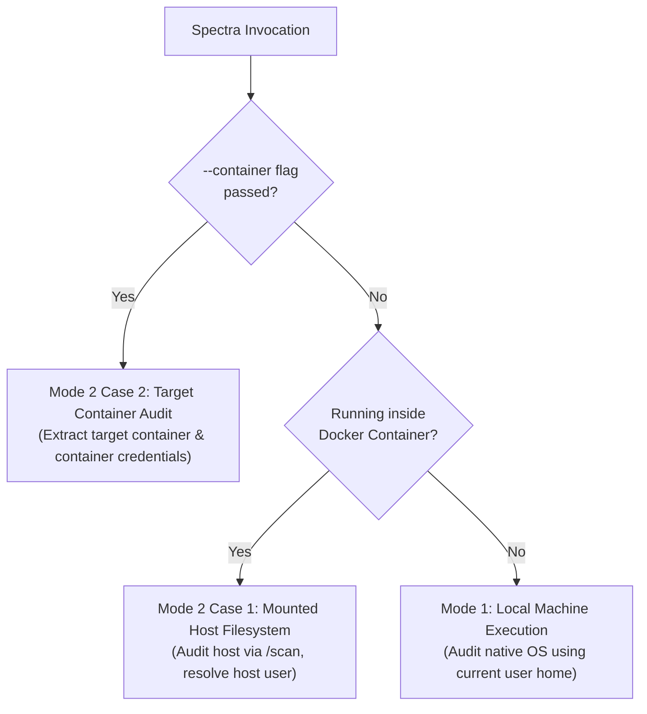

# Spectra Cloud & Container Cryptographic Scanning Architecture

This document provides a comprehensive operational and technical specification of how Spectra audits cryptographic assets (KMS keys, certificates, secrets, and algorithms) across local systems, mounted filesystems, and live containers.

---

## 1. The 3 Operational Modes

Spectra automatically identifies the execution environment and follows strict perimeters for credential discovery and asset scanning:

### Mode 1: Local Machine Execution (`python -m spectra.cli scan`)
- **Execution**: Run directly on Windows, macOS, or Linux.
- **Credential Scope**: Inspects the active user's home directory (`~/.aws`, `~/.azure`, `~/.config/gcloud`, `~/.ssh`).
- **Target**: Scans local directory paths supplied by the user.

### Mode 2 - Case 1: Spectra Container Auditing Mounted Host Filesystem
- **Execution**: Running Spectra inside a container with the host mounted (e.g., `-v /:/scan` or `-v /mnt/c:/scan`).
- **Active Mount Resolution (Step 1)**: Identifies the mount prefix from the target path via `/proc/self/mountinfo`.
- **User Discovery (Step 2)**:
  - **Priority A (`HOST_USER`)**: User passes `-e HOST_USER=$USER`.
  - **Priority B (Target Directory Heuristic)**: Autodetects user if `target_dir` contains `/home/<user>`, `/Users/<user>`, etc.
  - **Priority C (System Autodetection)**: Reads `/etc/wsl.conf` (WSL default user), `/etc/passwd` (UID 1000), or shell history timestamps (`.bash_history`, `NTUSER.DAT`).
- **Credential Scope (Step 3)**: Inspects the discovered user's home on the mounted filesystem.
- **Target**: Scans the target folder under `/scan`.

### Mode 2 - Case 2: Spectra Container Auditing Another Container (`--container`)
- **Execution**: Running Spectra with `--container <target_container_name_or_id>`.
- **Target Extraction**: Docker Archive API streams the selected application directory into `/tmp/spectra_containers/<name>/`.
- **Credential Scope**: **Exclusively inside the target container** (`/root` and `/home/*`). Spectra **never** accesses or uses the host's `/scan` credentials in this mode.

---

## 2. Container Filesystem Mounting & Comprehensive Dependency Auditing

Dependencies and shared libraries in containers can be located outside the application directory (e.g. system libraries in `/usr/lib`, Python packages in `/usr/local/lib/python*`, CA certificates in `/etc/ssl`, global modules, and binaries).

Spectra supports mounting and auditing the **entire container filesystem**:

### 1. Direct Whole-Filesystem Kernel Mount (`--pid=host`) - Zero Copy
- When Spectra is run with `--pid=host`, Docker shares the host PID namespace.
- Target container's entire root filesystem is directly accessible at `/proc/<pid>/root`.
- **Zero Copy / Instantaneous**: No extraction, no tar streaming, and 0 ms startup overhead.
- **Full Scope**: Grants Spectra immediate read access to the whole container filesystem (`/usr`, `/lib`, `/etc`, `/opt/nexis`, `/root`, etc.) to detect dependencies and crypto anywhere.
- Virtual filesystems (`/proc`, `/sys`, `/dev`, `/run`) are automatically excluded from scanners to prevent kernel recursion.

### 2. Archive API Streaming Fallback (without `--pid=host`)
- If `--pid=host` is not used, Spectra streams the container filesystem into `/tmp/spectra_containers/<name>/`.
- Defaults to `/` so that all container dependencies and configurations are extracted and audited.

---

## 3. Detailed Answers to Operational Questions

### Q1: If WSL is mounted, WSL has `/mnt/c` mounted. If the user is a WSL user, will it scan the C drive? If the user is a Windows user, will it scan the C drive mounted in WSL?
- **WSL User running `-v /:/scan`**: The root `/` of WSL is mounted to `/scan`. WSL mounts Windows at `/mnt/c`.
  - If target directory is `/scan/home/arnesharchlinux/...`, Spectra identifies the OS as Linux and user as `arnesharchlinux`, reading `/home/arnesharchlinux/.aws`, etc. It will **not** scan the C drive unless the target path explicitly points to `/scan/mnt/c/...`.
  - If target directory points to `/scan/mnt/c/...`, Spectra recognizes the target path inside `/mnt/c` as Windows.
- **Windows User**: When running natively in Windows, Spectra uses `C:\Users\<user>`.

### Q2: In Priority B of Step 2 (Mode 2 Case 1), will it autodetect the user from `target_dir` across Linux, Windows, macOS, WSL, and Windows mounted in WSL?
- **Yes.** Spectra decomposes `target_dir` into path segments and matches against discovered user profiles:
  - Linux: `/home/<username>/...` &rarr; `<username>`
  - Windows: `/Users/<username>/...` or `C:\Users\<username>\...` &rarr; `<username>`
  - macOS: `/Users/<username>/...` &rarr; `<username>`
  - Windows mounted in WSL: `/mnt/c/Users/<username>/...` &rarr; `<username>`

### Q3: In Priority C of Step 2, will it autodetect mounted filesystems (e.g. `/mnt/c` in WSL) and work for native Linux, macOS, and Windows?
- **Yes.** Priority C checks:
  1. WSL configuration file: `<mount>/etc/wsl.conf` &rarr; `[user] default = <username>`
  2. Standard Linux user database: `<mount>/etc/passwd` &rarr; first non-root UID 1000
  3. Windows registry / user hives: `<mount>/Users/<username>/NTUSER.DAT`
  4. Activity heuristics: Most recently modified `.bash_history`, `.zsh_history`, or profile.

### Q4: In Step 3, if Windows is mounted in WSL, will it correctly inspect Windows or WSL?
- **It inspects based on the resolved active mount:**
  - If your target path is `/scan/home/user`, it inspects WSL home (`/home/user/.aws`, `/home/user/.azure`, etc.).
  - If your target path is `/scan/mnt/c/Users/Arnesh`, it inspects Windows user home (`C:\Users\Arnesh\.aws`, `C:\Users\Arnesh\.azure`, etc.).
  - If credentials exist in one but not the other, Spectra's multi-user fallback merges discovered credentials so cloud scanning succeeds seamlessly.

---

## 4. Cloud Provider Pre-requisites

| Cloud Provider | Required Credentials / Config | Token Acquisition / Refresh |
| :--- | :--- | :--- |
| **AWS** | `~/.aws/credentials` (`aws_access_key_id`, `aws_secret_access_key`) or `~/.aws/config` | Managed via `aws configure` or IAM roles |
| **Azure** | `~/.azure/accessTokens.json` or `azureProfile.json` | Obtained via `az login` / `az account get-access-token` |
| **GCP** | `~/.config/gcloud/application_default_credentials.json` | Obtained via `gcloud auth application-default login` |
